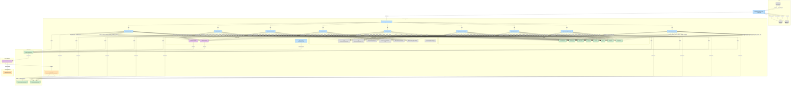

```mermaid
%%{ init: { "theme": "default", "flowchart": { "curve": "linear", "nodeSpacing": 50, "rankSpacing": 80 } } }%%
flowchart TB
    %% User Layer
    subgraph "Users" 
        direction TB
        SA[("SuperAdmin")]:::frontend
        MA[("MiniAdmin")]:::frontend
        EU[("End-User")]:::frontend
    end

    %% Web Server Layer
    WS["Web Server (Nginx/Apache + PHP-FPM)"]:::app

    %% Application Layer
    subgraph "Laravel Application" 
        direction TB
        R["Routes (routes/web.php)"]:::app
        C1["SuperAdminController"]:::app
        C2["SuperAdminLoginController"]:::app
        C3["MiniAdminController"]:::app
        C4["MiniAdminLoginController"]:::app
        C5["UserController"]:::app
        C6["CreditController"]:::app
        C7["TransactionController"]:::app
        C8["BankController"]:::app
        C9["OperationController"]:::app

        subgraph "Models" 
            direction TB
            M1["SuperAdmin"]:::data
            M2["MiniAdmin"]:::data
            M3["User"]:::data
            M4["Compte"]:::data
            M5["Credit"]:::data
            M6["Transaction"]:::data
            M7["ActivityLog"]:::data
            M8["DeleteRequest"]:::data
        end

        subgraph "Mail & Jobs"
            direction TB
            JM1["CodePin Mailable"]:::background
            JM2["profileMail Mailable"]:::background
            QC["Queue Config (config/queue.php)"]:::app
        end

        subgraph "Views & Assets"
            direction TB
            V1["Blade Views (super-admin)"]:::frontend
            V2["Blade Views (mini-admin)"]:::frontend
            V3["Blade Views (layouts & user)"]:::frontend
            A1["JS (resources/js/app.js)"]:::frontend
            A2["JS (resources/js/bootstrap.js)"]:::frontend
            A3["CSS (resources/css/app.css)"]:::frontend
            A4["Vite Config (vite.config.js)"]:::frontend
        end

        OCR["OCR Script (resources/python/ocr_extract.py)"]:::external
    end

    %% Data Stores Layer
    subgraph "Data Stores"
        direction TB
        DB["Relational DB (MySQL)"]:::data
        REDIS["Redis Cache/Queue"]:::data
        FS["File Storage (storage/app)"]:::data
    end

    %% Background Processing
    subgraph "Queue Workers" 
        direction TB
        QW["Queue Worker Process"]:::background
    end

    %% External Services
    subgraph "External Services"
        direction TB
        SMTP["SMTP Mail Service"]:::external
    end

    %% Flows
    SA -->|HTTP Request| WS
    MA -->|HTTP Request| WS
    EU -->|HTTP Request| WS

    WS -->|forwards to| R
    R -->|calls| C1 & C2 & C3 & C4 & C5 & C6 & C7 & C8 & C9

    C1 & C2 & C3 & C4 & C5 & C6 & C7 & C8 & C9 -->|uses| M1 & M2 & M3 & M4 & M5 & M6 & M7 & M8
    C1 & C2 & C3 & C4 & C5 & C6 & C7 & C8 & C9 -->|renders| V1 & V2 & V3
    C1 & C2 & C3 & C4 & C5 & C6 & C7 & C8 & C9 -->|assets| A1 & A2 & A3
    C1 & C2 & C3 & C4 & C5 & C6 & C7 & C8 & C9 -->|dispatches job| JM1 & JM2

    JM1 & JM2 -->|queued in| REDIS
    QC -->|configures queue| REDIS

    REDIS -->|processed by| QW
    QW -->|sends email via| SMTP

    QW -->|spawns| OCR
    OCR -->|reads/writes docs| FS
    OCR -->|updates| DB

    C1 & C2 & C3 & C4 & C5 & C6 & C7 & C8 & C9 -->|reads/writes| DB
    C1 & C2 & C3 & C4 & C5 & C6 & C7 & C8 & C9 -->|cache| REDIS

    WS -->|response| SA & MA & EU

    %% Styles
    classDef frontend fill:#dddddd,stroke:#888888,stroke-width:1px
    classDef app fill:#bbdefb,stroke:#1e88e5,stroke-width:1px
    classDef data fill:#c8e6c9,stroke:#2e7d32,stroke-width:1px
    classDef external fill:#ffe0b2,stroke:#fb8c00,stroke-width:1px
    classDef background fill:#e1bee7,stroke:#8e24aa,stroke-width:1px
``` 